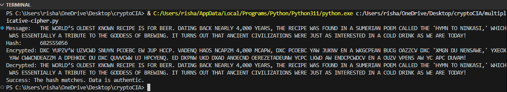
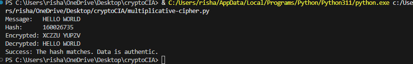

# Multiplicative Cipher & Integrity Hash

A Python implementation of a classical encryption scheme paired with a custom hashing function to ensure data integrity.

## Features
- **Multiplicative Cipher:** Uses modular arithmetic to encrypt/decrypt A-Z characters.
- **Polynomial Rolling Hash:** Generates a unique digital fingerprint of the text.
- **Integrity Verification:** Compares hashes before and after decryption to detect tampering.

## Core Logic
- **Encryption:** `(index * key) % 26`
- **Decryption:** `(index * modular_inverse) % 26`
- **Hashing:** `Sum(char_code * 31^i) % (10^9 + 9)`

## Usage
1. Ensure the key is coprime to 26 (e.g., 3, 5, 7, 11, 15, 17, 19, 21, 23, 25).
2. Run the script: `python main.py`

## Security Note
This is for **educational purposes**. For production systems (like IoT or AI monitors), use standard libraries like `cryptography` (AES-256) and `hashlib` (SHA-256).

